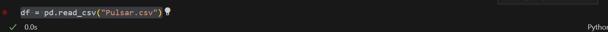

# Proyecto ML Datapath

## Pasos
### Primer paso
#### Creación del entorno virtual a través de la terminal.


#### Activación del entorno


### Creación del modelo de predicción
Importamos las librerías


### Lectura Data
Lectura archivo .CSV 


Datos descargados desde kaggle 
[Kaggle](https://www.kaggle.com/datasets/brsdincer/pulsar-classification-for-class-prediction?datasetId=1250649&sortBy=voteCount)


### Predicción nuevos datos
Probamos a la predicción de los datos de index 0 en el dataframe df puedes verlo en el Modelo.ipynb
```bash
python main.py 140.5625 55.68378214 -0.234571412 -0.699648398 3.199832776 19.11042633 7.975531794 74.24222492
```


Probamos a la predicción de los datos de index 1 en la variable 
```python
valores_positivos = df[df.Class == 1].reset_index(drop=True)
```

```bash
python main.py 99.3671875 41.57220208 1.547196967 4.154106043 27.55518395 61.71901588 2.20880796 3.662680136
```


### Creación de imagen

``` bash
docker build -t ml_datapath .
```


### Docker Run predicción


## Segunda Fase Creación de Api

Creación de la API con un patrón de diseño MVC(modelo - vista - controlador)

### Creación de archivo app main

inicializa la aplicación FastAPI y la monta en el servidor.


### Creación de modelo models.py

Utiliza Pydantic para la validación de datos.


### Creación de routes.py

Define las rutas


### Creación de controller.py

Contiene la lógica de la aplicación


### Consulta de modelo de Ml en la API con postman

Envio de los primeros datos para la predicción

Envio de los segundos datos para la predicción


### Obtención de prediciones en la API con postman

Consulta de los datos en prediciones anteriores con Get


